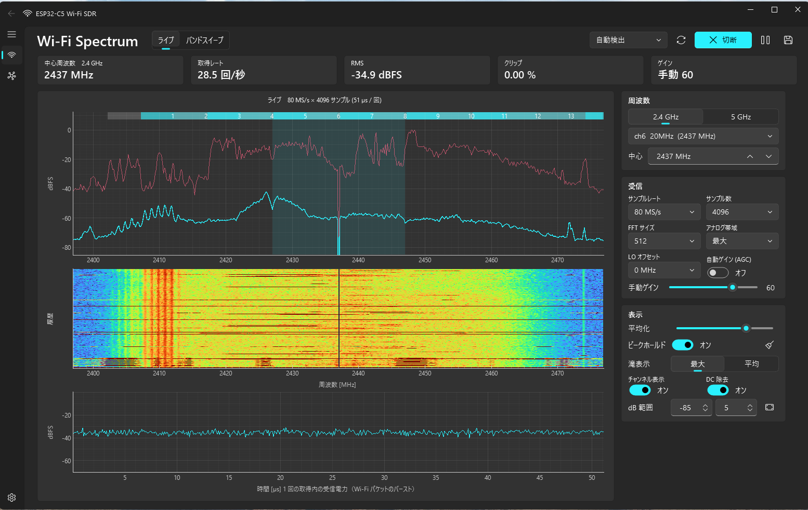
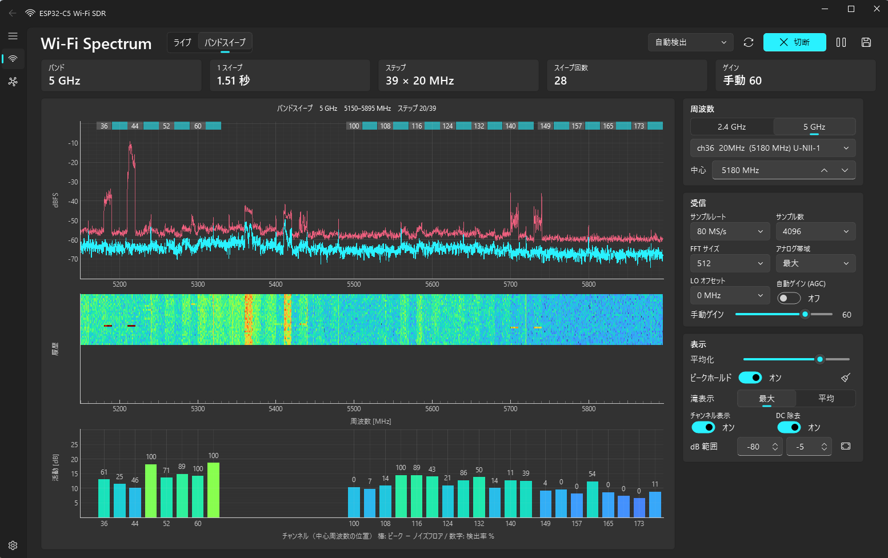

# ESP32-C5 Wi-Fi SDR (2.4 GHz / 5 GHz)

**English** | [日本語](README.ja.md)

A PC app that uses the built-in Wi-Fi 6 dual-band radio of the ESP32-C5 as an SDR and shows the
spectrum, waterfall and packet bursts of the 2.4 GHz and 5 GHz bands.

- Firmware: the official prebuilt images of [ESPARGOS/esp-sdr](https://github.com/ESPARGOS/esp-sdr) (GPL-3.0)
- PC app: Python (PySide6 + PySide6-Fluent-Widgets + pyqtgraph; the classic version uses tkinter + matplotlib) — the code in this repository
- The protocol and implementation are based on [ESPARGOS/esp-sdr](https://github.com/ESPARGOS/esp-sdr) (see [Acknowledgements](#acknowledgements))
- The UI can be switched between English and Japanese at run time

## Screenshots

**Live mode (2.4 GHz, ch6)**: spectrum (peak hold and average), waterfall, and received power over time within one capture



**Band sweep (5 GHz, 5150–5895 MHz)**: spectrum of the whole band, and activity and detection rate per 20 MHz channel



(The screenshots show the Japanese UI.)

## Quick start

**You need**: an ESP32-C5 development board (2 MB flash or more), a USB cable, and a PC with Python 3.10 or later (tested on Windows)

1. **Install the libraries** (first time only)
   ```powershell
   pip install -r requirements.txt
   ```
2. **Connect the board**: plug the board's "USB" port (native USB) into the PC and look up its COM port (e.g. in Device Manager).
   **The COM port number differs from PC to PC** (and can change with the USB socket you use). `COM6` / `COM7` in this README are only examples; use the number shown on your PC.
3. **Flash the firmware** (first time only): the official images are downloaded automatically, checked against their SHA-256 and written.
   ```powershell
   python flash_c5.py COM7      # replace COM7 with your port
   ```
4. **Start the app**: the port is detected automatically. You can also double-click `run_sdr.bat`.
   ```powershell
   python sdr_fluent.py
   ```

**Basic operation**
- **Live** at the top shows one frequency; **Band sweep** shows the whole 2.4 GHz or 5 GHz band
- Change the center frequency, channel, gain and so on in the right-hand panel
- **Click** a graph to place a marker, **double-click** to tune to that frequency, **right-click** to remove the marker
- **Save I/Q** stores the received data in `recordings/`
- **Settings** (bottom left) → **Language** switches between English and Japanese instantly; the choice is remembered

If it does not work: if you see "No device running the ESP-SDR firmware was found", check that step 3 completed,
or give the port explicitly, e.g. `python sdr_fluent.py COM7`.

## Files

| File | Contents |
| --- | --- |
| `sdr_fluent.py` | **GUI app (WinUI 3 / Fluent Design style)**. PySide6 + PySide6-Fluent-Widgets + pyqtgraph |
| `sdr_app.py` | Classic GUI (tkinter + matplotlib). Runs without the Qt libraries |
| `sdr_core.py` | Receive thread and signal processing (shared by both GUIs) |
| `espsdr.py` | Driver for the ESP-SDR serial protocol (`INFO` / `FREQ` / `GAIN` / `BANDWIDTH` / `CAP16` etc.) |
| `i18n.py` | UI language (Japanese / English): translation table and run-time switching (shared by both GUIs) |
| `wifi_channels.py` | 2.4 / 5 GHz Wi-Fi channel tables (20/40/80/160 MHz, U-NII-1 to 4) |
| `flash_c5.py` | Flashes the firmware onto the ESP32-C5 (with SHA-256 check) |
| `run_sdr.bat` / `run_sdr_classic.bat` | Launchers for the Fluent / classic version |
| `firmware/` | Firmware images (downloaded from the official site by `flash_c5.py`; not in the repository) |
| `recordings/` | I/Q data saved with **Save I/Q** (not in the repository) |

### Fluent UI

- Left navigation: **Spectrum** / **Device** (connection info, log, recordings folder) / **Settings** (language, light / dark / system theme, waterfall colors)
- Top: live / band sweep switch, port selection, connect, pause, save I/Q
- Stat cards: center frequency, capture rate, RMS, clipping, gain (in sweep mode: band, sweep time, sweep count)
- Right panel: frequency / receiver / gain / display settings
- Drag a graph horizontally to pan, use the wheel to zoom
- **Click**: place a marker showing frequency, channel, mean level and peak (dBFS), updated live; drag to move it
- **Double-click**: tune to that frequency (resets average and peak) / **Right-click**: remove the marker

## Usage (command details)

Replace `COM6` / `COM7` below with your own COM port (the number differs from PC to PC).

```powershell
pip install -r requirements.txt     # first time only
python flash_c5.py COM6             # first time only: download and flash the firmware
python sdr_fluent.py                # start (port auto-detected); run_sdr.bat does the same
python sdr_fluent.py --light        # start with the light theme
python sdr_fluent.py --lang en      # start in English (ja / en; default: last used, first run: OS language)
python sdr_app.py                   # classic GUI (tkinter)
python sdr_app.py COM7 --freq 5180  # set port and frequency
python sdr_app.py COM7 --sweep 5    # start in 5 GHz band sweep (--sweep 2.4 also works)
python sdr_app.py --samples 2048    # samples per capture (default 4096)
# --freq / --sweep / --samples / --lang work with both GUIs
```

Connecting through the board's **"USB" port (native USB Serial/JTAG)** is recommended.
The "UART" port (CH343, 2 Mbaud) also works, at about half the transfer speed.

| Connection | Effective throughput | Update rate (8192 samples) |
| --- | --- | --- |
| Native USB | 256 kB/s | ~15 /s (4096: 28 /s, 2048: 52 /s) |
| UART / CH343 | 133 kB/s | ~8 /s |

Native USB only sends data once the PC asserts DTR, so `espsdr.py` asserts DTR only for Espressif USB
(VID 0x303A). RTS stays deasserted, so the board is not reset.

## Features

**Live mode** (fixed center frequency)
- Spectrum (average and peak hold), waterfall
- Received power over time within one capture (Wi-Fi packet bursts are visible)
- Wi-Fi channel strip and a highlight of the selected channel width (20/40/80/160 MHz)
- Click the spectrum or waterfall for a level marker, double-click to tune there (the classic GUI tunes on click)
- Sample rates 80/40/20/10/8/4 MS/s, FFT 256–2048, analog bandwidth 11–48 MHz
- AGC and manual gain (0–83), DC removal, LO offset
- I/Q recording (`.npy`, `.cfile` readable by GNU Radio / inspectrum, and `.json` metadata)

**Band sweep mode** (whole band)
- 2.4 GHz (2400–2500 MHz): 7 steps, ~0.5 s per sweep
- 5 GHz (5150–5895 MHz, ch36–177): 39 steps, ~1.6 s per sweep (USB, 4096 samples; ~2.7 s over UART)
- Activity per 20 MHz channel (peak − noise floor) and detection rate %

## Measured behavior and caveats

- **Update rate**: almost all of the time goes into the serial transfer (the FFT on the PC takes 0.1 ms). Even native USB tops out at 256 kB/s.
- **Observation is intermittent snapshots**: one capture is 80 MS/s × 8192 samples ≈ 100 µs.
  Nothing is received between captures, so not every packet shows up (peak hold helps).
- **Passband**: flat to about ±22 MHz around the center; both edges roll off even at 80 MS/s.
  80 MHz and 160 MHz channels cannot be seen in full at once (use the sweep).
- **LO leakage on 5 GHz**: above 5.45 GHz the local oscillator leaks into about ±5 MHz around the LO.
  The sweep avoids it by stitching only the parts 10–20 MHz away from each LO.
  In live mode, if the channel you watch overlaps the LO, set **LO offset** to ±12 / ±16 MHz.
- **Gain while sweeping**: AGC would change the gain at every step and cause steps in the trace, so sweeps
  always use the manual gain (default 60, measured to show the noise floor without saturating easily).
- **Levels**: dBFS values are uncalibrated relative levels (not dBm).
- Receive on 5 GHz only within the radio regulations of your country. This firmware does not transmit.

## Protocol overview (`espsdr.py`)

Newline-terminated ASCII commands are sent and text replies received. The reply to `CAP16 <n> <rate>` is
`DATA <n> <crc32> <µs>` followed by `n×2` bytes (signed 8-bit I, Q repeated), verified with
CRC32 (zlib compatible). Rate indices 0–5 are 80/40/20/10/8/4 MS/s.
See the upstream README and `docs/rx-controls.md` for details.

## How drawing is kept fast

- Every capture received during one frame is folded into the display (average, peak and waterfall rows), so slow drawing never throws data away.
- Axes, ticks and the channel strip are cached as a background; each frame redraws only the traces and the waterfall image (matplotlib blitting).
- The signal you can observe per second is limited by the transfer speed to about 110–120 k samples/s (about 0.15% of 80 MS/s).
  Fewer samples per capture give more updates, but each observation is shorter.

## Acknowledgements

This project is based on [ESPARGOS/esp-sdr](https://github.com/ESPARGOS/esp-sdr).

- The firmware running on the ESP32-C5 is the official prebuilt esp-sdr image, used as is (downloaded by `flash_c5.py` from the [official installer](https://espargos.net/espsdr/app/firmware/)).
- The serial protocol in `espsdr.py` (commands, `CAP16` reply format, rate indices etc.) was implemented from the esp-sdr README and `docs/rx-controls.md`.

The esp-sdr firmware is distributed under GPL-3.0. Its source code is available from the repository above.

## License

The code in this repository is released under the [GNU General Public License v3.0](LICENSE) (GPL-3.0-or-later).

Licenses of the main dependencies (installed with pip, not included in this repository):

| Library | License |
| --- | --- |
| PySide6 | LGPL-3.0 |
| PySide6-Fluent-Widgets | GPL-3.0 (commercial use requires a separate license) |
| pyqtgraph | MIT |
| numpy / pyserial | BSD |
| matplotlib | Matplotlib License (PSF-based) |
| esptool | GPL-2.0-or-later (run as a separate process) |
